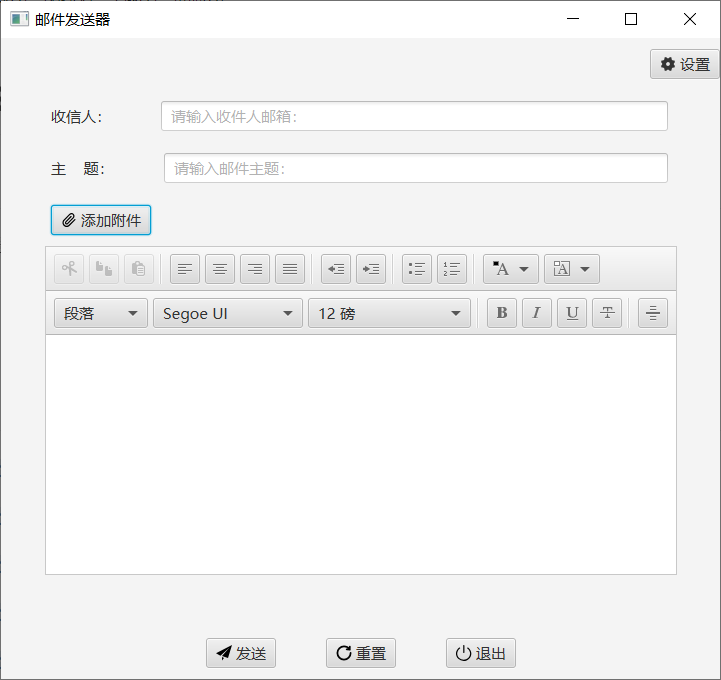

# SendEmail
## 项目介绍

一个能发送邮件的小程序，发送界面如下：

## 参考链接

[Java实战之邮件发送器（1）——项目简述](http://mp.weixin.qq.com/s?__biz=MzU4MDc0NDI0NQ==&mid=2247484159&idx=1&sn=5ca3aeb78ad4b600f5556a489c7057bf&chksm=fd5367a5ca24eeb3f64b1a7b12a37d39d7c663ead47370e15d57bbf0793d64bc75b73dac0e39&scene=21#wechat_redirect)

[Java实战之邮件发送器（2）——实现主界面和设置界面](http://mp.weixin.qq.com/s?__biz=MzU4MDc0NDI0NQ==&mid=2247484160&idx=1&sn=4e8c48ded23c6a8e1e587fe8e9f93021&chksm=fd53665aca24ef4ca2067002bc2ed5eb70c82cd80947d0959df255792852374d89cad374b14b&scene=21#wechat_redirect)

[Java实战之邮件发送器（3）——实现设置图标、重置和退出功能](http://mp.weixin.qq.com/s?__biz=MzU4MDc0NDI0NQ==&mid=2247484161&idx=1&sn=b5ac6adf6a1aedb09575e910cd02e1da&chksm=fd53665bca24ef4d142de75125c157f7fc73e0a803ba01349ad693dc7cda69b4074b4196c7df&scene=21#wechat_redirect)

[Java实战之邮件发送器（4）——完成邮件信息的保存设置](http://mp.weixin.qq.com/s?__biz=MzU4MDc0NDI0NQ==&mid=2247484162&idx=1&sn=0d26e58de558288616fc8b88d6b1ecbc&chksm=fd536658ca24ef4e680ef38af5e2ba9ee69c73b46b7b1d04cbe75277dc82beda386bf8fdccc9&scene=21#wechat_redirect)

[Java实战之邮件发送器（5）——完成发送邮件功能](http://mp.weixin.qq.com/s?__biz=MzU4MDc0NDI0NQ==&mid=2247484163&idx=1&sn=a0719d1f78ecd174d93163b5a9232896&chksm=fd536659ca24ef4fc2a4409b5c3b98cb4ae7c59b371c33eedf367b3131b770732884a3095f3f&scene=21#wechat_redirect)

[Java实战之邮件发送器（6）——完成添加附件发送功能](http://mp.weixin.qq.com/s?__biz=MzU4MDc0NDI0NQ==&mid=2247484164&idx=1&sn=9711b7d2fcd32bc33401689f62690f57&chksm=fd53665eca24ef480c2aaf17159cb0d0cc70d2aad45b77cfa8e04410f6ac5ce5196c912260f3&scene=21#wechat_redirect)